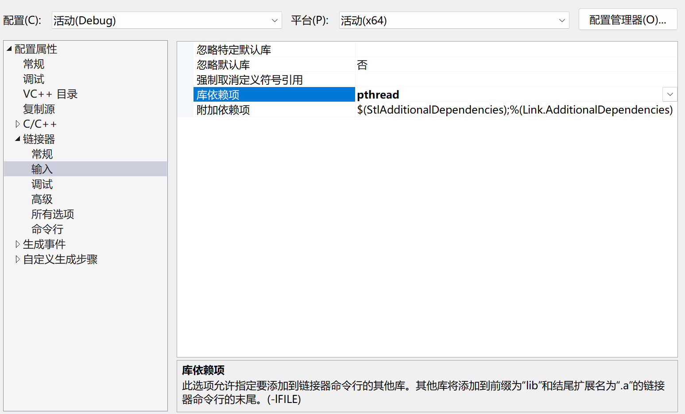

# Cpp-Web-Server

## 一、项目说明

### 1.1 项目描述
本项目在 `Linux` 系统下实现了 `C++` 版本的**基于反应堆模型的多线程 `Web` 服务器**。

### 1.2 应用技术
`Linux`、`C++`、`Tcp`、套接字编程(`Socket`)、`I/O`多路复用(`Epoll` + `Poll` + `Select`)、线程池、反应堆模型

## 二、项目配置
### 2.1 环境及软件版本
- **操作系统**: `Ubuntu 22.04.1 LTS`
- **cmake**: `3.22.1`
- **gcc**: `11.3.0`
- **gdb**: `12.1`

### 2.2 启动方法
1. `Visual Studio`
如果是通过 `Visual Studio` 需要设置库依赖项，然后将头文件和源文件放在一个项目中，运行即可


2. `bash`
- 构建项目: ```bash build.sh```
- 运行项目: ```bash run.sh```

## 三、总结

### 3.1 主要工作

### 3.2 个人收获

### 3.3 遇到的问题
1. 两个类相互调用<br>
**问题描述**: 假设 A 类存在成员变量 B 类成员，且 B 类存在成员变量 A 类成员，此时编译器会产生“未定义的符号”的错误提示。<br>
**问题分析**: 上述情况会产生循环依赖，编译器无法解决这个依赖关系，因为编译器在定义数据时需要知道数据的剧情大小，此时两者相互包含，编译器无法准确知道数据的大小，因此会报错。<br>
**解决方案**: 可以使用**前向声明**，但是需要注意的是前向声明只适用于引用、指针等操作，如果只是使用指针，则无需引用头文件且在使用前必须初始化指向一个存在的对象，但是如果需要使用包含类的对象则必须要添加头文件。<br><br>

2. `Broken Pipe`<br>
**问题描述**: 频繁进行大文件访问的时候，有概率会断开连接，产生 `Broken Pipe` 异常。<br>
**问题分析**: `TCP` 通信，在 `C++` 中是通过 `send` 函数发送数据。如果客户端和服务器端一直保持连接，则不会产生问题，但是当服务器和客户端之间的连接断开后（这里是客户端断开连接，可能是宕机或者被 `Kill`），服务器还给客户端发送数据的话，`Linux` 内核会检测到这个错误并向程序发送 `SIGPIPE` 信号，就会产生 `Broken Pipe` 异常。这个错误是由 `TCP` 底层导致的，即使程序逻辑上是在发送完数据后才断开连接。<br>
**解决方案**: 在 `send` 函数的最后一个参数设置为 `MSG_NOSIGNAL`，表示程序忽略 `Linux` 的 `SIGPIPE` 信号，从而不被中断。<br><br>

3. 含中文(特殊符号)文件<br>
**问题描述**: 访问含中文或者特殊符号文件时会提示 404 错误。<br>
**问题分析**: `HTTP GET` 请求的请求行不支持特殊字符，如果有特殊字符就会自动进行转换成 `UTF-8`（三个字符），如将“国”字转换为 `%EF%9B%BD`，此时服务器接收到的数据就不是原本的信息，因此无法找到相应的文件。<br>
**解决方案**: 进行解码，将 `UTF-8` 对应的三个字符转换成一个特殊字符，从而让服务器了解到客户端真正访问的文件，具体的函数实现可以在网上查询。<br><br>

4. `POST` 请求体结尾不含 `\r\n`<br>
**问题描述**: 在解析 `POST` 方式请求体时，发现无法通过 `\r\n` 来获取请求体结束的位置。<br>
**问题分析**: 首先，`HTTP` 协议并没有规定请求体（响应体）要以 `\r\n` 作为结束符；其次，响应体（请求体）的内容是多种多样的，当数据内容包含 `\r\n` 时，解析出来的响应体就是不完整的。<br>
**解决方案**: 大部分 `POST` 请求，会在请求头处添加 `Content-Length`，可以根据 `Content-Length` 来获取 `POST` 的请求体，并根据格式 `xxx=yyy&xxx=yyy` 进行拆分。<br>
**注意**: 并不是所有 `POST` 都会在请求数据时添加 `Content-Length`，如 `chunked` 编码，即`分块传输编码`.尤其是当不知道数据大小的时候，当使用 `chunked` 编码时需要在请求头添加 `Transfer-Encoding: chunked` 字段，否则 `HTTP/1.1` 规范都会要求 `POST` 请求的消息体必须包含 `Content-Length` 字段。<br><br>


### 3.4 总结
1. 与多进程和多线程技术相比，`I/O` 多路复用技术的最大优势是系统开销小，系统不必创建进程/线程，也不必维护这些进程/线程，从而大大减小了系统的开销。
2. `select` 是跨平台的，`epoll` 和 `poll` 只能在 `Linux` 平台下使用；`epoll` 底层实现是红黑树，`select` 和 `poll` 底层实现是线性表；`epoll` 和 `poll` 没有最大文件描述符数量限制，`select` 是 `1024`。
3. 当产生循环包含的问题的时候，可以通过前向声明解决，但是此时只能通过使用类成员的指针。